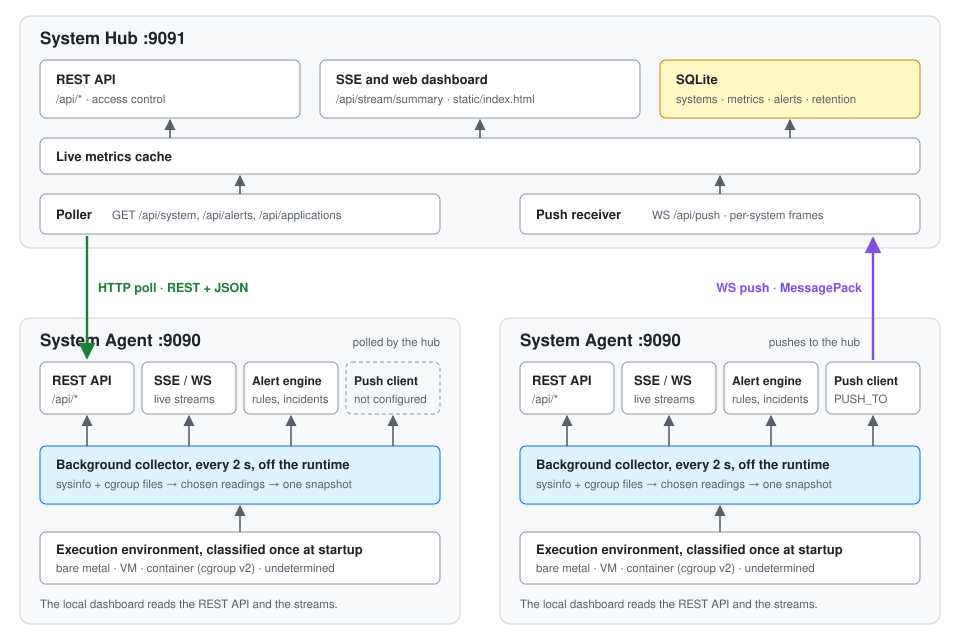

<!-- SPDX-License-Identifier: AGPL-3.0-or-later -->
<!-- Copyright (C) 2026 Pietrangelo Masala -->

# System Agent & Hub — Distributed Linux Monitoring

A two-component monitoring stack for Linux servers. **System Agent** runs on every machine and exposes system metrics. **System Hub** aggregates data from many agents into a central dashboard with persistent storage and alerting.

---

## Architecture



**Three connection modes** between agent and hub:

| Mode | Direction | Protocol | Use case |
|---|---|---|---|
| **HTTP Poll** | Hub → Agent | REST + JSON | Agent behind firewall, hub can reach it |
| **Push** | Agent → Hub | WebSocket + MessagePack | Agent can connect out, lower latency, binary efficient |
| **Mail** | Agent → relay → Hub's mailbox | SMTP + sealed MessagePack | Agent can reach neither the hub nor the internet, only its network's SMTP relay (see [Mail transport](#mail-transport-smtp)) |

Agents auto-register on the hub on first connection (push mode), on their first accepted report (mail mode), or when manually added via the dashboard (poll mode).

---

## Project structure

```
monitoring-agent/
├── Cargo.toml                  # System Agent
├── Dockerfile                  # System Agent container image
├── docker-compose.yml          # Local test stack (agent + hub)
├── .env.example                # Template for docker-compose token overrides
├── static/index.html           # Single-machine dashboard
└── src/
    ├── main.rs                 # Server entry, startup snapshot, push client spawn
    ├── models.rs               # Data types
    ├── snapshot.rs             # The published snapshot, its seq and staleness
    ├── environment/            # Execution environment, cgroup capacity, reading sourcing (pure)
    ├── state.rs                # Shared state (history ring buffers)
    ├── auth.rs                 # Token auth middleware
    ├── alerts.rs               # Alert engine (thresholds, cooldowns)
    ├── push/
    │   ├── mod.rs              # Push client → connects to Hub
    │   └── application_frame.rs # Scrape rounds as application frames
    ├── applications/           # Spring Boot scraping (config, actuator, rounds, wire DTO)
    ├── collectors/
    │   ├── mod.rs              # Background collector: reads, publishes, records
    │   ├── environment.rs      # Environment evidence and cgroup files, read under a root
    │   ├── sampler.rs          # Long-lived sysinfo + cgroup reader, never publishes its priming
    │   ├── system.rs           # CPU, memory, disk, network, processes
    │   ├── packages.rs         # dpkg/rpm/pacman/apk
    │   ├── services.rs         # systemd units
    │   ├── containers.rs       # Docker containers
    │   └── ports.rs            # TCP listening ports
    └── routes/
        ├── mod.rs
        ├── api.rs              # REST endpoints
        ├── sse.rs              # Server-Sent Events streams
        └── ws.rs               # WebSocket endpoint

monitoring-agent/system-hub/
├── Cargo.toml                  # System Hub
├── Dockerfile                  # System Hub container image
├── static/index.html           # Multi-system hub dashboard
├── system-hub.db               # SQLite (auto-created)
└── src/
    ├── main.rs                 # Server entry
    ├── listen.rs               # HUB_LISTEN parsing
    ├── clock.rs                # The hub's wall clock
    ├── models.rs               # Data types
    ├── registry.rs             # Registry rules: memory capacity, last seen, status, poll interval
    ├── state.rs                # Shared state: live metrics, applications, the SSE summary
    ├── db/
    │   ├── mod.rs              # SQLite: migrations, systems and alerts
    │   └── history.rs          # SQLite: metric history, snapshot and round stores, pruning
    ├── snapshot.rs             # The snapshot rule, live metrics (pure)
    ├── snapshot_intake.rs      # Stores a snapshot from either source
    ├── token_bucket.rs         # The token bucket both paces share (pure)
    ├── hourly_warning.rs       # At most one warning an hour (pure)
    ├── collector/
    │   ├── mod.rs              # HTTP poller (agent /api/system and /api/alerts)
    │   ├── capped_body.rs      # Reads a poll's body up to a cap
    │   └── application_poll.rs # Polls /api/applications
    ├── application_wire.rs     # Scrape rounds as agents send them (frame and poll JSON)
    ├── round_intake.rs         # Admits and stores a round from either source
    ├── applications.rs         # Scrape rounds: admission, freshness, metric points
    ├── retention.rs            # Periodic pruning of app:* points
    ├── push/
    │   ├── mod.rs              # Push receiver: handshake, message loop
    │   ├── ingest.rs           # Snapshot frames: decoding, registration, storing
    │   ├── connection.rs       # A connection's decode budget, pace and counts
    │   └── config.rs           # Push token, socket limits, deadlines
    └── routes/
        ├── mod.rs
        ├── api.rs              # REST endpoints
        ├── applications.rs     # A system's latest scrape round
        └── sse.rs              # SSE stream with live metrics
```

---

## Building

### Prerequisites

- **Rust** 1.85+ (edition 2024)
- **Linux** (agent uses `/proc`, `/sys`, `dpkg`, `rpm`, `systemctl`, `ss`, `docker`)

### Build both components

```sh
# Agent
cd monitoring-agent
cargo build --release
# → target/release/system-agent

# Hub
cd monitoring-agent/system-hub
cargo build --release
# → target/release/system-hub
```

### Local test stack (docker-compose / podman)

`docker-compose.yml` at the repo root builds both binaries and wires an agent to a hub
over push, entirely in containers — no host Rust toolchain required. Works with either
Docker or Podman (`podman compose` or `podman-compose`):

```sh
podman compose up --build
# Agent dashboard: http://localhost:9090/
# Hub dashboard:   http://localhost:9091/
```

Copy `.env.example` to `.env` to override the default dev-only tokens
(`HUB_PUSH_TOKEN`, `SYSTEM_AGENT_TOKEN`, `PUSH_INTERVAL`). The hub's SQLite file persists
in the `hub-data` named volume across restarts. The hub's dashboard is part of the image, not
the volume, so `--build` always serves the current one. Hub images built before this fix
served the dashboard from the volume, which kept the copy from the volume's creation: rebuild
with `--build` to get the current dashboard, including its XSS fixes. The stale
`/app/static` left in an old volume is ignored and can be deleted.

A containerized agent monitors *its container*, not the podman/docker host (RFC 0014): with
a readable cgroup v2 hierarchy, its CPU, memory, swap and uptime are the container's,
measured against the container's limits (`--cpus`, `--memory`), and its process list is the
container's. No bind mount is needed, and none widens the container's access to the host.
Load average, core count and disk sizes stay the host's, and packages are the image's.

---

## Running

### 1. Start the System Hub (central server)

```sh
cd monitoring-agent/system-hub

# Basic — no auth, HTTP only
./target/release/system-hub
# → Dashboard: http://localhost:9091/
# → API:       http://localhost:9091/api/health
# → Push:      ws://localhost:9091/api/push

# With push authentication token
HUB_PUSH_TOKEN=my-secret-key ./target/release/system-hub
```

### 2. Start System Agents (on each monitored machine)

```sh
cd monitoring-agent

# Standalone mode — serves its own dashboard at :9090
./target/release/system-agent
# → Dashboard: http://localhost:9090/

# With API token (protects the agent's REST API)
SYSTEM_AGENT_TOKEN=agent-key ./target/release/system-agent

# Push mode — connects directly to the Hub
PUSH_TO=ws://hub-host:9091 \
PUSH_TOKEN=my-secret-key \
PUSH_INTERVAL=2 \
./target/release/system-agent
```

### 3. Register agents in the Hub dashboard

Open **http://localhost:9091/** and click **"+ Add System"**:

| Field | Value |
|---|---|
| Name | `Production DB` |
| URL | `http://192.168.1.50:9090` |
| API Token | `agent-key` (if set on the agent) |
| Poll Interval | `10` seconds |

For push-mode agents, they appear automatically — no manual registration needed.

---

## Configuration reference

### System Agent — environment variables

| Variable | Default | Description |
|---|---|---|
| `SYSTEM_AGENT_LISTEN` | `0.0.0.0:9090` | Address and port the agent serves on: a literal IP and a port, e.g. `0.0.0.0:9190`, `127.0.0.1:9090` (loopback only) or `[::]:9090`; host names are refused. Unset or empty means the default. A value that isn't an address, or isn't valid UTF-8, refuses startup (exit 78). `0.0.0.0` and `127.0.0.1` are IPv4 only; `[::]` is also IPv4 on Linux by default (`net.ipv6.bindv6only=0`), IPv6 only on the BSDs and Windows. Port `0` lets the OS choose, logged at INFO, so it's for tests and one-off runs. A changed port must be matched in the container's port mapping and in the URL a hub polls; an agent on loopback can't be polled from another host |
| `SYSTEM_AGENT_TOKEN` | *(none)* | API token required for REST access |
| `PUSH_TO` | *(none)* | Hub WebSocket URL, e.g. `ws://hub:9091`; its port is the hub's `HUB_LISTEN` port |
| `PUSH_TOKEN` | *(none)* | Shared secret for hub authentication |
| `SYSTEM_AGENT_ID_FILE` | *(none)* | Absolute path of a file that keeps the push system id. When the file exists its content is the id; when it's missing, the id resolved at that start is written there, so it survives container re-creations. A relative path, or a file that isn't UTF-8 or holds an invalid id, refuses startup (exit 78); a file that can't be read or written refuses it with exit 1. Unset or empty: nothing is written. The image has `/var/lib/system-agent`, owned by the agent's user, for a volume (see below) |
| `PUSH_INTERVAL` | `2` | Seconds between push ticks (min 2). A tick sends the latest snapshot only if the hub hasn't had it yet; a stale snapshot closes the connection, and the agent reconnects once a fresh one is read |
| `MAIL_TO` | *(none)* | The hub's mailbox address: turns the mail transport on (RFC 0017). Can't be combined with `PUSH_TO` (exit 78) |
| `MAIL_RELAY` | *(none)* | `host:port` of the SMTP relay; required with `MAIL_TO` |
| `MAIL_TLS` | `starttls` | `starttls` (required: the session fails without it), `tls` (implicit, port 465), or `none`, accepted only for a loopback relay. Certificates are always verified |
| `MAIL_RELAY_CA` | system roots | PEM file to verify the relay's certificate with (an internal CA) |
| `MAIL_RELAY_USERNAME` / `MAIL_RELAY_PASSWORD` | *(none)* | SMTP AUTH, both or neither, over TLS only. Never logged |
| `MAIL_FROM` | `system-agent@<host name>` | Sender address |
| `MAIL_KEY` | *(none)* | This system's mail key, base64, from `system-hub mail-key <system id>`; required with `MAIL_TO`. Never logged |
| `MAIL_INTERVAL` | `300` | Seconds between scheduled reports, 60 to 86400 |
| `MAIL_SAMPLE_INTERVAL` | `60` | Seconds between the samples a report carries, 10 up to `MAIL_INTERVAL`, at most 60 per report |
| `SPRING_BOOT_APPS` | *(none)* | Spring Boot applications to monitor, as comma-separated `name=actuator-base-url` pairs (at most 16), e.g. `orders=http://127.0.0.1:8081/actuator`. A name is 1–64 of `A-Z a-z 0-9 _ . -`. The URL is http(s), with no credentials, query or fragment |
| `SPRING_BOOT_APP_<NAME>_USERNAME` / `_PASSWORD` | *(none)* | HTTP Basic credentials for one application; both or neither. `<NAME>` is the name upper-cased, with `-` and `.` as `_`. A username can't contain `:`, and neither value a control character (HTTP Basic can't carry them). Never logged. Over plain `http://` to a non-loopback address, the agent logs a startup warning |
| `SPRING_BOOT_SCRAPE_INTERVAL` | `15` | Seconds between scrape rounds, 10 to 3600 |

The agent parses `SYSTEM_AGENT_LISTEN`, the `SPRING_BOOT_*` variables and, when `PUSH_TO` is
set, `SYSTEM_AGENT_ID_FILE` before it starts anything, and resolves its push system id there,
once. If a value is malformed, it logs which variable is wrong (never its value) and exits with
code **78** (`EX_CONFIG`); no other failure uses that code (an id file that can't be read or
written exits 1).

To keep a containerised agent's id across re-creations, mount a volume and point the variable
into it:

```yaml
    environment:
      SYSTEM_AGENT_ID_FILE: /var/lib/system-agent/id
    volumes:
      - agent-id:/var/lib/system-agent
```

Turning this on re-creates the container, whose new host name is the id captured: delete the
old system on the hub once. With applications configured, the agent
scrapes each one's Actuator every interval and serves the result on `GET /api/applications`.
See [Spring Boot applications](#spring-boot-applications) for what each application must expose.

### System Hub — environment variables

| Variable | Default | Description |
|---|---|---|
| `HUB_LISTEN` | `0.0.0.0:9091` | Address and port the hub serves its API, push endpoint and dashboard on, in the same form as the agent's `SYSTEM_AGENT_LISTEN` (IPv4/IPv6 and port-0 notes included). Parsed before anything else: an invalid or non-UTF-8 value makes the hub refuse to start, naming the variable, never the value, before any file is created. Agents' `PUSH_TO` must use its port |
| `HUB_MAIL_DIR` | *(none)* | Maildir (with `new/` and `cur/`) the hub reads mail reports from (RFC 0017). Set with `HUB_MAIL_KEY` or not at all; a directory that isn't a Maildir refuses startup |
| `HUB_MAIL_KEY` | *(none)* | Mail master key: 32 bytes, base64 (`head -c 32 /dev/urandom \| base64`). Each system's key is derived from it by `system-hub mail-key <system id>`. Never logged |
| `HUB_PUSH_TOKEN` | *(none)* | Shared secret agents must provide on push connect. Read once at startup; unset or empty disables push auth (the hub logs a warning); a value that isn't valid UTF-8 makes the hub refuse to start |
| `HUB_STATIC_DIR` | `static` | Directory the dashboard is served from. Unset or empty means `static` under the working directory, unchecked. A set value must be a directory the hub can search (read permission alone is not enough), or the hub refuses to start. The container image sets `/usr/share/system-hub/static` |

---

## API Reference

### System Agent (default port 9090)

| Endpoint | Description |
|---|---|
| `GET /api/health` | Health check + version |
| `GET /api/system` | Full snapshot — CPU, memory, disk, network, load, processes — plus `collected_at` (unix seconds, the agent's clock, when it was read) and `environment`: `kind` (`bare_metal` \| `virtual_machine` \| `container` \| `undetermined`), `runtime` (a container's: `docker` \| `podman` \| `kubernetes` \| `lxc` \| `systemd_nspawn`, or `null` when unnamed or not a container), `hypervisor` (a virtual machine's: `kvm` \| `qemu` \| `vmware` \| `hyperv` \| `wsl` \| `xen` \| `virtualbox` \| `amazon_ec2` \| `google_compute` \| `other`, else `null`), `cgroup` (a container's: `v2` \| `unreadable`, else `null`) and `load_scope` (`host` in a container, else `environment`), classified once at startup. In a container with a readable cgroup v2 hierarchy, CPU, memory, swap and uptime are the container's, against its limits; `cpu`, `memory` and `swap` each carry a `source` (`cgroup` \| `kernel` \| `unavailable`), `cpu` its `capacity_cpus`, its `steal_percent` (the share of CPU time a hypervisor withheld since the previous snapshot, host-wide, on every environment; `0` on bare metal, `null` when it can't be measured) and `memory`/`swap` their cgroup `limit` (`{"bounded": <bytes>}` \| `"unbounded"`, absent outside a container's cgroup). Load average and `logical_cores` stay the host's. Every `/api/system*` route serves the background collector's latest snapshot (at most one 2 s tick old) and answers `503` with `{"error": "stale snapshot"}` when it was read more than 30 s ago |
| `GET /api/system/cpu` | CPU model, cores, usage %, `capacity_cpus`, `steal_percent` and `source` (as in `/api/system`) |
| `GET /api/system/memory` | Memory and swap, each with `source` and, in a container's cgroup, `limit` (as in `/api/system`) |
| `GET /api/system/disk` | All mounted disks |
| `GET /api/system/network` | Interfaces, IPs, traffic |
| `GET /api/system/processes?limit=N` | Top N processes by CPU |
| `GET /api/history/{cpu,memory,swap,load,disk}?limit=N` | Ring-buffer history (3600 points) |
| `GET /api/alerts` | Active alerts + rule count |
| `GET /api/alerts/config` | Current alert rules |
| `POST /api/alerts/config` | Replace alert rules (JSON body) |
| `GET /api/{packages,services,containers,ports}` | Installed packages, services, Docker, ports |
| `GET /api/applications` | Latest scrape round of the Spring Boot applications: round id (`run`, `seq`), `interval_secs`, `scraped_at`, and per application its `name`, `health` (`up`, `down`, `out_of_service`, `unknown`, `unreachable`), `version` and `gauges`. `round`, `interval_secs` and `scraped_at` are `null` (and `applications` is `[]`) before the first round and whenever no scrape loop runs |
| `GET /api/stream/system` | **SSE** — CPU/mem/load, `cpu_capacity_cpus`, `cpu_steal_percent` and `collected_at` every 2s. A stale snapshot sends one `stale` event, then nothing until a fresh one; the stream stays open |
| `GET /api/stream/processes` | **SSE** — Top processes every 3s; `stale` as above |
| `GET /api/stream/alerts` | **SSE** — Active alerts every 3s |
| `GET /api/ws/system` | **WebSocket** — Full state, `cpu_capacity_cpus`, `cpu_steal_percent` and `collected_at` every 2s; one `{"type": "stale"}` message while the snapshot is stale |

### System Hub (default port 9091)

| Endpoint | Method | Description |
|---|---|---|
| `GET /api/health` | GET | Health check |
| `GET /api/systems` | GET | List registered systems |
| `POST /api/systems` | POST | Register a system `{name, url, token, poll_interval_secs}` |
| `GET /api/systems/{id}` | GET | System details |
| `PUT /api/systems/{id}` | PUT | Update config (a `poll_interval_secs` above 2^63-1 is refused with 422 and nothing is stored) |
| `DELETE /api/systems/{id}` | DELETE | Remove system + all data, live metrics included. A push agent that is still connected is disconnected by its next frame, and registers the system again at once, with no history: stop the agent first |
| `GET /api/summary` | GET | Aggregated stats (online/offline/alerts) |
| `GET /api/systems/{id}/metrics?metric=cpu&limit=300` | GET | Time-series for a specific metric |
| `GET /api/systems/{id}/history?limit=300` | GET | Combined CPU + memory history |
| `GET /api/systems/{id}/applications` | GET | The system's latest Spring Boot scrape round (pushed, or polled from the agent's `/api/applications`), with `received_at`, `age_secs` and `freshness` (`fresh`/`stale`) computed on the hub; all three `null` and `applications: []` when none is held. History: `/metrics?metric=app:<name>:<gauge>` |
| `GET /api/alerts?acknowledged=false&limit=50` | GET | Alert history |
| `POST /api/alerts/{id}/acknowledge` | POST | Acknowledge an alert |
| `GET /api/stream/summary` | **SSE** | Live summary + system list + live metrics: one summary every 5 s, shared by every subscriber; a new subscriber gets the current one at once |
| `GET /api/push` | **WebSocket** | Agent push endpoint (MessagePack) |

**Polling** (`POST /api/systems` with a URL): every 30 s the hub GETs the agent's
`/api/system`, `/api/alerts` and `/api/applications` with the system's token in
`X-API-Key`. It follows **no redirects**: a registered URL that answers with a 3xx shows as
offline, with the 3xx in `last_error`; register the final URL instead. An `/api/system`
answer over 4 MiB also marks the system offline. The snapshot it carries goes through the
same rules as a pushed one (see Data frames below). An agent without
`/api/applications` (404) or without a round simply has no applications.

### Push protocol (WebSocket + MessagePack)

**Handshake:**

```
Agent → Hub:  {"type":"auth","system_id":"<system id>","token":"<secret>"}
Hub → Agent:  {"type":"auth_ok"}   or   {"type":"auth_error","message":"..."}
```

The system id is resolved once at startup: the content of `SYSTEM_AGENT_ID_FILE` when set
and present, else the host's `/etc/machine-id`, else the dbus machine id, else its host name
(`/proc/sys/kernel/hostname`), else a random UUID (logged with a warning: it lives for that
process only). A source that is missing or breaks the rule is skipped. It must be one URL path
segment: not empty, at most 255 bytes, and not `.` or `..`. The hub registers an unseen id as a
new push system, with status `unknown` until its first snapshot is stored, and named after the
first 8 bytes of the id until the first data frame supplies a hostname. A push connection
presenting a polled system's id is accepted, but its end never marks that system offline.
When `HUB_PUSH_TOKEN` is set, `token` must match it. The possible `auth_error` messages are:

| `message` | Cause |
|---|---|
| `expected auth message` | the first message is text but isn't JSON with `"type":"auth"` and a `system_id` (a first message that isn't text gets no answer) |
| `invalid token` | `HUB_PUSH_TOKEN` is set and `token` doesn't match it |
| `invalid system_id` | the token is valid (or not required) but `system_id` is empty, longer than 255 bytes, or `.` / `..` |
| `handshake timeout` | no first message arrived within 10 s of the upgrade |
| `registry unavailable` | the hub couldn't check or register the system id (a database error, or a registration that panicked). A known id's row is never replaced |
| `transport mismatch` | the system id belongs to a mail system (RFC 0017): delete it on the hub before moving the agent to push |

The agent retries after 5 s, as for any `auth_error`.

**Status of a push system.** Of a system's open push connections, the one whose snapshot was
stored last is current (before any, the first one accepted); only its end marks the system
offline. Push systems are never polled. Every 30 s a sweep marks offline a push system with no
live current connection, or one that reads online while its current connection never sent a
snapshot, once the hub has run for 120 s. At every hub start, push systems that read `online`
read `unknown` until their agent's first snapshot is stored; one whose agent is gone goes
offline 120 to 150 s after the start. A binary message that is neither a snapshot nor an
application frame is dropped and counted: the first one is logged at `warn`, the count when the
connection ends.

**Deadlines and limits:** after `auth_ok`, the client must send some message at least every
90 s, or the hub closes the connection (marking the system offline when it was current). Pings count, and the hub
answers them itself; the agent pings every 30 s. Every message is at most 512 KiB. An
oversize message gets no answer and no Close frame: before `auth_ok` the hub drops the
connection at once, and after it the hub stops reading for 30 s, then closes the connection
(with a TCP reset if unsent data is still queued).

**Data frames (every 2s):**

Agent sends binary MessagePack-encoded frames. The encoding is **positional**
(`rmp_serde::to_vec`): each frame is a MessagePack *array* of the values below, in this exact
order, with no field names on the wire. Field order is therefore part of the protocol.

```
MessagePack({
  system_id: String,
  hostname: String,
  os_name: String,
  kernel: String,
  cpu_percent: f32,
  cpu_cores: usize,
  cpu_model: String,
  memory_percent: f32,
  memory_used_display: String,
  memory_total_display: String,
  memory_used_bytes: u64,
  memory_total_bytes: u64,
  swap_percent: f32,
  load_one: f64,
  load_five: f64,
  load_fifteen: f64,
  uptime_seconds: u64,
  uptime_display: String,
  disks: [{mount_point, usage_percent, total_display, used_display}],
  top_processes: [{pid, name, cpu_usage, memory_usage_display, memory_percent}],
  timestamp: u64
})
```

MessagePack is ~50-70% smaller than equivalent JSON. A typical 2 KB JSON snapshot compresses to ~600-800 bytes.

**What the hub keeps.** Every binary message, whatever its kind, spends one token of the
connection's decode budget before it is decoded: 3 messages, then one per second. A message
past the budget is dropped undecoded (the connection stays open), and the count is logged
when the connection ends. The agent sends at most one snapshot every 2 s (`PUSH_INTERVAL`)
and one round every 10 s, well inside it. Then, for a snapshot frame:

- a `timestamp` above 2^63 − 1 refuses the whole frame;
- `cpu_percent`, `memory_percent`, `swap_percent`, `load_one` and `load_five` are stored when
  finite, each on its own;
- each disk is stored as `disk:<mount_point>` when its mount point is 1 to 256 bytes with no
  control character and its usage is finite; the first 1024 such disks are kept, in the
  order sent. What is left out is logged, at `warn` at most once an hour per system;
- an `uptime_display` or `memory_total_display` over 64 bytes, or holding a control
  character, is ignored and the stored value kept, and so is a `memory_total_bytes` above
  2^63 − 1 (the memory rules apply to polled systems too).

A snapshot's points, the pruning of their series and the system's status are written in one
transaction.

**Application frames (on each scrape round):**

An agent with `SPRING_BOOT_APPS` also sends each scrape round on the same connection, once
right after `auth_ok` if a round exists, then whenever a new one is published. It is a
positional 5-element MessagePack array:

```
[ "applications.v1", run: String (UUID), seq: u64, interval_secs: u64,
  [ [ name: String, health: String, version: String | nil, { gauge: f64 } ], … ] ]
```

`health` is `up`, `down`, `out_of_service`, `unknown` or `unreachable`; gauges use the wire
names of `/api/applications`. The hub refuses a whole round with an unknown `kind`, a `run`
that isn't a UUID, an interval outside 10..=3600 s, more than 16 applications, or an invalid or
repeated name. It reads an unknown health as `unknown`, skips unknown gauges and non-finite
values, and cuts versions to 64 characters. It drops an exact re-send of one of the system's
last 8 accepted rounds, and more than 2 rounds per connection within 8 s (then one per 8 s).
An accepted round's points are stored at the hub's time as `app:<name>:<gauge>` and
`app:<name>:up` (1 when `up`, else 0). A hub older than this frame drops it silently and keeps
storing snapshots. The golden bytes are `testdata/application-frame-v1.msgpack`.

---

## Default alert rules (per agent)

| Condition | Severity | Duration | Cooldown |
|---|---|---|---|
| CPU > 90% | Warning | 60s | 5 min |
| CPU > 95% | Critical | 30s | 5 min |
| Memory > 90% | Warning | 60s | 5 min |
| Memory > 95% | Critical | 30s | 5 min |
| Disk > 85% | Warning | 5 min | 10 min |
| Disk > 95% | Critical | 60s | 10 min |

Configure via `POST /api/alerts/config` or programmatically through the API.

---

## Deployment patterns

### Single machine (just the agent)

```sh
./system-agent
# Dashboard at http://localhost:9090/
```

### Fleet with push (agents → hub)

```sh
# Hub server
HUB_PUSH_TOKEN=secret ./system-hub

# Each agent
PUSH_TO=ws://hub.internal:9091 PUSH_TOKEN=secret ./system-agent
```

### Fleet with polling (hub → agents)

Agents run with `SYSTEM_AGENT_TOKEN`, hub polls them. Best for agents behind NAT/firewall.

```sh
# Agent
SYSTEM_AGENT_TOKEN=agent-secret ./system-agent

# Hub (add via dashboard or API)
curl -X POST http://hub:9091/api/systems \
  -H 'Content-Type: application/json' \
  -d '{"name":"web-01","url":"http://10.0.1.5:9090","token":"agent-secret","poll_interval_secs":10}'
```

### Mail transport (SMTP)

For hosts that can reach neither the hub nor the internet, only their network's SMTP relay
(RFC 0017). The agent mails one sealed report every `MAIL_INTERVAL` (and one at once when an
alert incident starts, at most one a minute); the hub reads the reports that reach its mailbox
from a Maildir, which an MTA you already run delivers into (postfix local delivery, or
fetchmail/getmail from an IMAP or POP3 mailbox). The hub opens no new port.

```sh
# Hub: a master key, and a Maildir an MTA delivers into
export HUB_MAIL_KEY=$(head -c 32 /dev/urandom | base64)
HUB_MAIL_DIR=/var/mail/system-hub ./system-hub

# For each mailed system: derive its key from its system id (the agent logs it at startup)
HUB_MAIL_KEY=… ./system-hub mail-key web-01

# Agent, inside the isolated network
MAIL_TO=system-hub@example.org MAIL_RELAY=smtp.internal:25 MAIL_KEY=<derived key> ./system-agent
```

- **Sealed end to end.** Each report is MessagePack encrypted and authenticated with
  XChaCha20-Poly1305 under the system's own key (HKDF-SHA256 of the master key and the system
  id), so relays can't read or alter it, and a host's key can only speak for that host. The
  hub trusts no mail header.
- **What a report carries:** a sample every `MAIL_SAMPLE_INTERVAL` (CPU, memory, swap, load,
  uptime, disks; no processes), every alert incident active since the previous report, and
  the latest scrape round.
- **On the hub:** every message in `new/` is deleted once handled, accepted or refused (at
  most 256 per 10 s scan, 1 MiB each). Duplicates and replays are refused by their report id;
  reports older than 7 days, or more than 5 minutes ahead of the hub's clock, are refused. A
  report delivered late adds its history but doesn't change the system's status. A mail system
  is marked offline (`mail overdue`) once 3 intervals and 15 minutes pass without a report.
- **Latency:** minutes, not seconds; this mode is for systems that otherwise wouldn't be seen.
- **Moving an agent between push and mail:** stop the old transport on the agent, let the
  mailbox drain, delete the system on the hub, then start the agent with the new transport.
- **Rolling back the hub** to a version without mail: disable the mail systems first, or the
  older hub polls their `mail://` URL; re-enable them after upgrading again.

### Spring Boot applications

An agent started with `SPRING_BOOT_APPS` scrapes each application's Actuator and sends every
scrape round to the hub, by push or when the hub polls it. The hub dashboard shows them in the
system's **Applications** section, and each gauge's history is at
`/api/systems/{id}/metrics?metric=app:<name>:<gauge>`.

```sh
SPRING_BOOT_APPS=orders=http://127.0.0.1:8081/actuator \
SPRING_BOOT_APP_ORDERS_USERNAME=monitor SPRING_BOOT_APP_ORDERS_PASSWORD=… \
PUSH_TO=ws://hub.internal:9091 PUSH_TOKEN=… ./system-agent
```

Each application must expose Actuator's `health`, `info` and `metrics` endpoints:

```properties
management.endpoints.web.exposure.include=health,info,metrics
```

On Spring Boot 4, Micrometer's meters also need the `spring-boot-starter-micrometer-metrics`
starter. A meter the application doesn't publish (no HikariCP pool, or no HTTP request served
yet) shows as `—`, never as zero.

- **Rates need a cumulative registry.** Requests/s, 5xx/s, mean latency and GC pause are
  computed from running totals. The Simple registry (Boot's default when no other is present)
  and the Prometheus registry keep them. A step-based registry alone (Datadog, Elastic, New
  Relic, OTLP with delta temporality) reports each step's counts instead, and those gauges then
  show nothing useful.
- **Mean latency includes the agent's own requests.** Each round makes about 12 Actuator
  requests per application. The agent subtracts them from requests/s, but it can't take them
  out of the mean latency, so on a quiet application it leans toward Actuator's own (fast)
  answers.

### TLS termination

Neither component has built-in TLS. Place them behind a reverse proxy, and bind the component
to loopback (`HUB_LISTEN=127.0.0.1:9091`, or `SYSTEM_AGENT_LISTEN=127.0.0.1:9090` for an agent
polled through a proxy) so the plain port can't be reached around the proxy:

```nginx
# Nginx example for the hub
server {
    listen 443 ssl;
    server_name hub.example.com;

    ssl_certificate /etc/ssl/certs/hub.crt;
    ssl_certificate_key /etc/ssl/private/hub.key;

    location / {
        proxy_pass http://127.0.0.1:9091;
        proxy_http_version 1.1;
        proxy_set_header Upgrade $http_upgrade;
        proxy_set_header Connection "upgrade";
        proxy_set_header Host $host;
        proxy_set_header X-Real-IP $remote_addr;
    }
}
```

Agents would then use `wss://hub.example.com` for push or `https://agent-host:9090` for polling.

---

## Database

The hub stores everything in **SQLite** (`system-hub.db`, created automatically).

| Table | Contents |
|---|---|
| `systems` | Registered agents, URLs, tokens, status, OS info |
| `metrics` | Time-series: cpu, memory, swap, load1, load5, disk:{mount}, and per application app:{name}:{gauge} and app:{name}:up |
| `alerts` | Alert history, one record per alert incident, with acknowledge support |
| `metric_retention` | Per-system per-metric retention (default 24h) |

A snapshot's points are written in one transaction, which also prunes each of their series
past its retention period, at most 16 rows per point.
Application metrics (`app:*`) are pruned by a task every 10 minutes, past their retention
row or 24h. Run `sqlite3 system-hub.db` for direct queries.

---

## Dashboards

| URL | Description |
|---|---|
| `http://agent:9090/` | Single-machine dashboard with CPU gauge, charts, alerts |
| `http://hub:9091/` | Multi-system hub with system cards, live metrics, alert feed, and per system its Spring Boot applications |

Both are self-contained single HTML files with zero external dependencies. The hub dashboard updates live via SSE every 5 seconds.

---

## License

GNU Affero General Public License v3.0 or later
